# Expression in normal and tumor tissues

In this section we will compare 5hmC expression levels between normal tissue and primary tumors (paired samples, N = 70) and between primary and metastatic tumors (unpaired samples, N = 41 for metastatic tumors).

Comparison of 5hmC expression levels will be done considering 3 approaches: 1) using the raw H-score values; 2) categorizing 5hmC expression in low and high using the median as the cutoff point; 3) categorizing 5hmC expression in low and high using the upper tertile as the cutoff point. Only the median values will be used for the analysis.

***

## Normal tissue vs. primary tumors
### First approach: Using raw H-scores
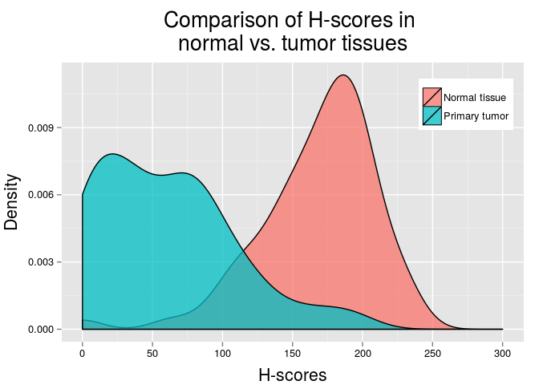 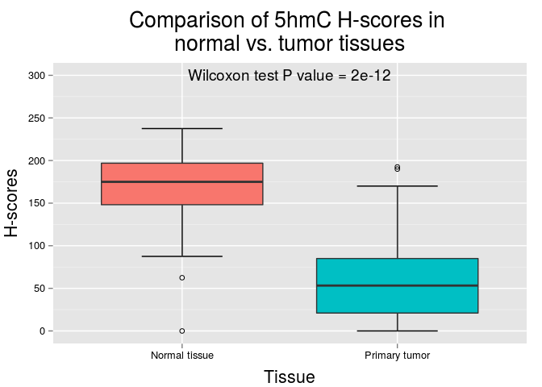 

|                    | Normal tissue | Primary tumor |
|:-------------------|:-------------:|:-------------:|
|Mean                |     168.0     |     59.8      |
|Standard Deviation  |     41.4      |     48.0      |
|Median              |     175.0     |     53.2      |
|Interquartile Range |     48.8      |     64.0      |
|Minimum             |      0.0      |      0.0      |
|Maximum             |     237.5     |     192.5     |

***

### Second approach: Expression levels using the median as cutoff point
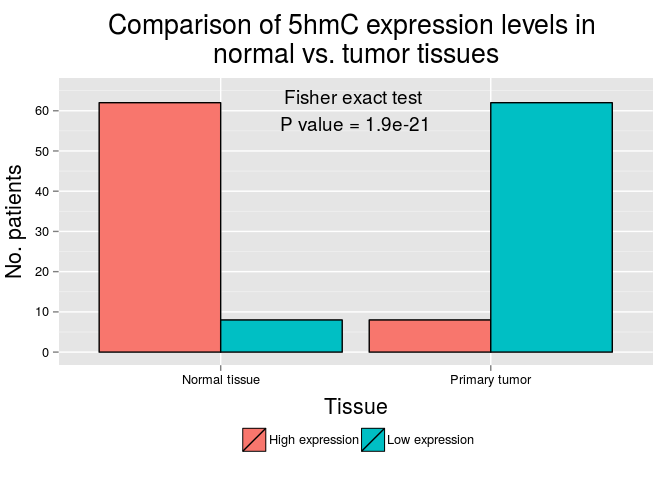 

|              | High expression |  %   | Low expression |  %   |
|:-------------|:---------------:|:----:|:--------------:|:----:|
|Normal tissue |       62        | 88.6 |       8        | 11.4 |
|Primary tumor |        8        | 11.4 |       62       | 88.6 |

***

### Third approach: Expression levels using the upper tertile as cutoff point
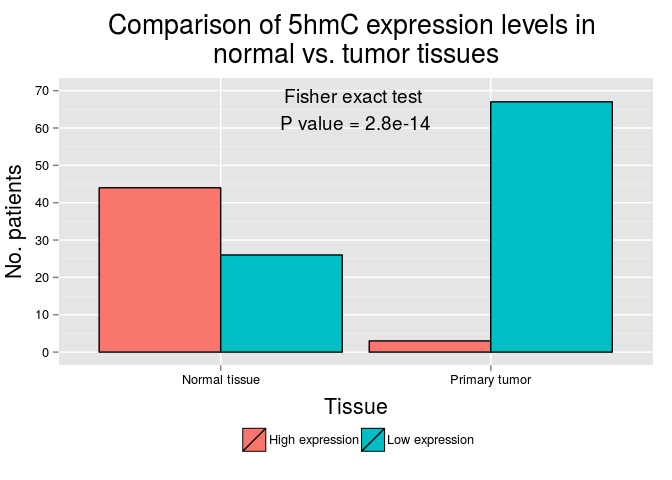 

|              | High expression |  %   | Low expression | %  |
|:-------------|:---------------:|:----:|:--------------:|:--:|
|Normal tissue |       44        | 93.6 |       26       | 28 |
|Primary tumor |        3        | 6.4  |       67       | 72 |

***

## Primary vs. metastatic tumors
### First approach: using raw H-scores
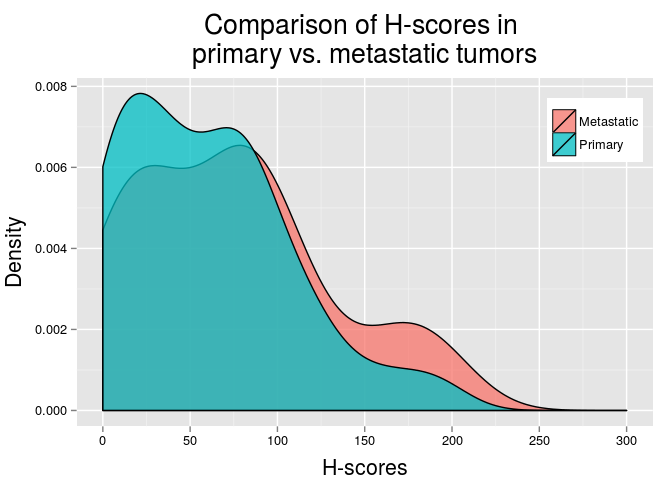 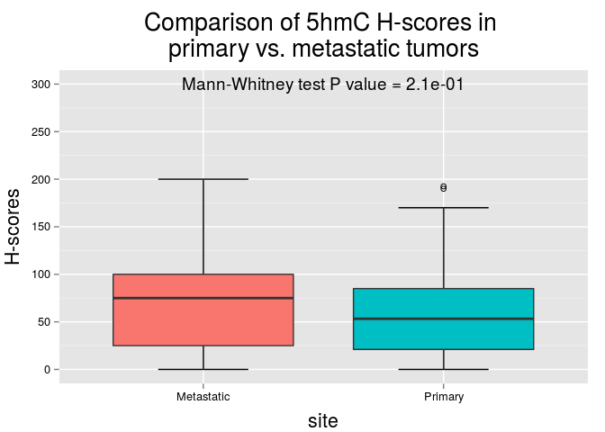 

|                    | Metastatic | Primary |
|:-------------------|:----------:|:-------:|
|Mean                |    74.5    |  59.8   |
|Standard Deviation  |    56.4    |  48.0   |
|Median              |    75.0    |  53.2   |
|Interquartile Range |    75.0    |  64.0   |
|Minimum             |    0.0     |   0.0   |
|Maximum             |   200.0    |  192.5  |

***

### Second approach: Expression levels using the median as cutoff point
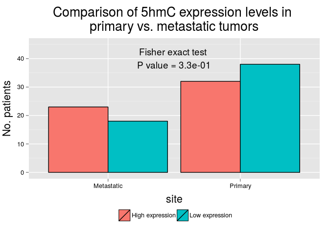 

|           | High expression |  %   | Low expression |  %   |
|:----------|:---------------:|:----:|:--------------:|:----:|
|Metastatic |       23        | 41.8 |       18       | 32.1 |
|Primary    |       32        | 58.2 |       38       | 67.9 |

***

### Third approach: Expression levels using the upper tertile as cutoff point
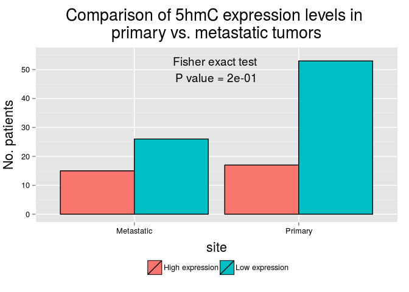 

|           | High expression |  %   | Low expression |  %   |
|:----------|:---------------:|:----:|:--------------:|:----:|
|Metastatic |       15        | 46.9 |       26       | 32.9 |
|Primary    |       17        | 53.1 |       53       | 67.1 |

***

## Normal tissue vs. primary tumors vs. metastatic tumors

### First approach: using raw H-scores
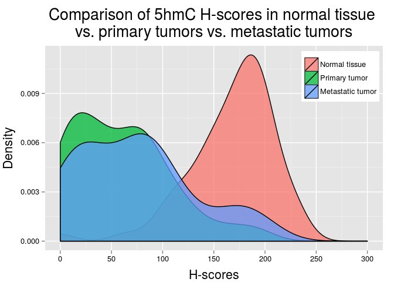 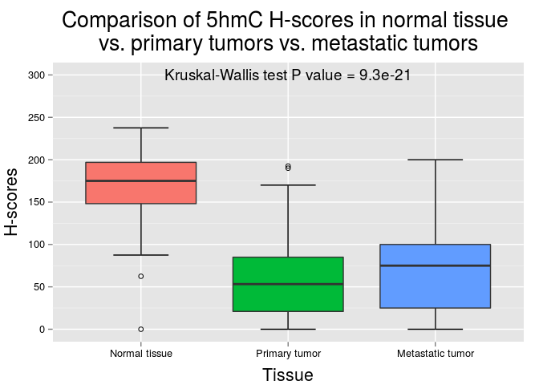 

|                    | Normal tissue | Primary tumor | Metastatic tumor |
|:-------------------|:-------------:|:-------------:|:----------------:|
|Mean                |     168.0     |     59.8      |       74.5       |
|Standard Deviation  |     41.4      |     48.0      |       56.4       |
|Median              |     175.0     |     53.2      |       75.0       |
|Interquartile Range |     48.8      |     64.0      |       75.0       |
|Minimum             |      0.0      |      0.0      |       0.0        |
|Maximum             |     237.5     |     192.5     |      200.0       |

***

### Second approach: Expression levels using the median as cutoff point
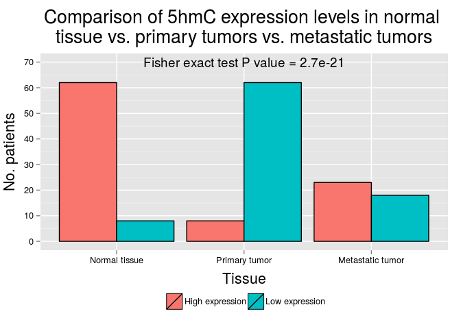 

|                 | High expression |  %   | Low expression |  %   |
|:----------------|:---------------:|:----:|:--------------:|:----:|
|Normal tissue    |       62        | 66.7 |       8        | 9.1  |
|Primary tumor    |        8        | 8.6  |       62       | 70.5 |
|Metastatic tumor |       23        | 24.7 |       18       | 20.5 |

***

### Third approach: Expression levels using the upper tertile as cutoff point
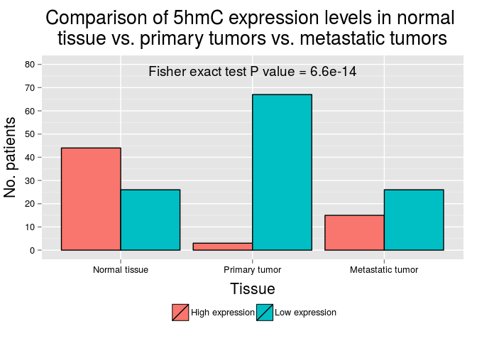 

|                 | High expression |  %   | Low expression |  %   |
|:----------------|:---------------:|:----:|:--------------:|:----:|
|Normal tissue    |       44        | 71.0 |       26       | 21.8 |
|Primary tumor    |        3        | 4.8  |       67       | 56.3 |
|Metastatic tumor |       15        | 24.2 |       26       | 21.8 |

***
