# Expression and outcome in primary tumors

For this section we will use 3 different approaches for evaluating the association of 5hmC and outcome: 1) using 5hmC H-scores; 2) categorizing 5hmC median expression in low/high levels using the median of the distribution as the cutoff point; 3) categorizing 5hmC median expression in low/high levels using the upper tertile of the distribution as the cutoff point.

Outcomes will include tumor progression, overall mortality, and cancer-related mortality. This section includes only the analysis of primary tumors. Metastatic tumors are analyzed separately.

## Approach #1
In this approach we will compare 5hmC `H-scores` against clinicopathologic features and outcome. Comparisons will be made using the Mann-Whitney U test or the Kruskal-Wallis test. Age and tumor size will be categorized in 2 levels using the median age as the cutoff point.

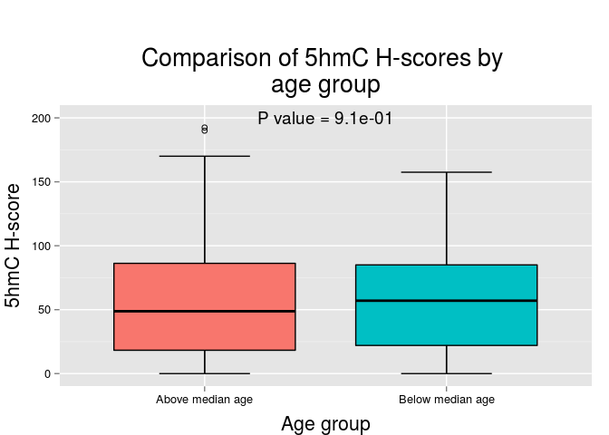 

|                    | Above median age | Below median age |
|:-------------------|:----------------:|:----------------:|
|Mean                |       62.7       |       57.8       |
|Standard Deviation  |       56.6       |       42.0       |
|Median              |       48.8       |       57.0       |
|Interquartile Range |       68.0       |       63.0       |
|Minimum             |       0.0        |       0.0        |
|Maximum             |      192.5       |      157.5       |

 

|                    | Female | Male  |
|:-------------------|:------:|:-----:|
|Mean                |  78.8  | 52.7  |
|Standard Deviation  |  62.1  | 40.1  |
|Median              |  87.5  | 45.0  |
|Interquartile Range |  96.8  | 56.5  |
|Minimum             |  0.0   |  0.0  |
|Maximum             | 192.5  | 170.0 |

 

|                    | African-American | Asian | Caucasian | Other |
|:-------------------|:----------------:|:-----:|:---------:|:-----:|
|Mean                |       48.2       |   1   |   62.6    | 75.0  |
|Standard Deviation  |       40.0       |  NA   |   50.1    | 36.1  |
|Median              |       42.0       |   1   |   57.0    | 65.0  |
|Interquartile Range |       76.2       |   0   |   59.8    | 35.0  |
|Minimum             |       0.0        |   1   |    0.0    | 45.0  |
|Maximum             |      102.5       |   1   |   192.5   | 115.0 |

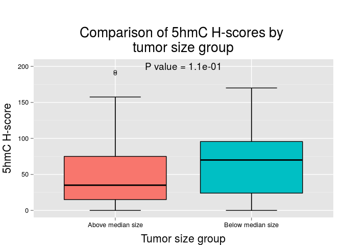 

|                    | Above median size | Below median size |
|:-------------------|:-----------------:|:-----------------:|
|Mean                |       53.9        |       65.3        |
|Standard Deviation  |       52.9        |       43.9        |
|Median              |       35.0        |       70.0        |
|Interquartile Range |       60.0        |       71.6        |
|Minimum             |        0.0        |        0.0        |
|Maximum             |       192.5       |       170.0       |

 

|                    | pT1a  | pT1b  |  pT2  | pT3a  | pT3b |
|:-------------------|:-----:|:-----:|:-----:|:-----:|:----:|
|Mean                | 65.1  | 70.7  | 93.8  | 38.1  |  1   |
|Standard Deviation  | 42.5  | 64.4  | 72.5  | 37.2  |  NA  |
|Median              | 73.8  | 40.0  | 93.8  | 29.5  |  1   |
|Interquartile Range | 67.2  | 57.5  | 51.2  | 58.4  |  0   |
|Minimum             |  0.0  |  0.0  | 42.5  |  0.0  |  1   |
|Maximum             | 170.0 | 192.5 | 145.0 | 130.0 |  1   |

 

|                    | Grade 1 | Grade 2 | Grade 3 | Grade 4 |
|:-------------------|:-------:|:-------:|:-------:|:-------:|
|Mean                |  82.5   |  64.8   |  45.8   |  26.2   |
|Standard Deviation  |  53.0   |  47.0   |  42.1   |  23.0   |
|Median              |  82.5   |  69.2   |  35.0   |  26.2   |
|Interquartile Range |  37.5   |  63.0   |  63.2   |  16.2   |
|Minimum             |  45.0   |   0.0   |   0.0   |  10.0   |
|Maximum             |  120.0  |  190.0  |  145.0  |  42.5   |

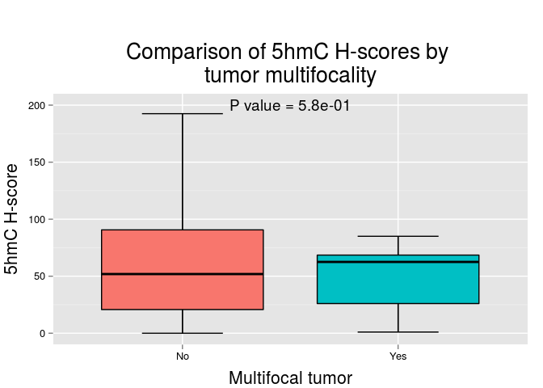 

|                    |  No   | Yes  |
|:-------------------|:-----:|:----:|
|Mean                | 61.5  | 50.3 |
|Standard Deviation  | 50.5  | 30.8 |
|Median              | 51.9  | 62.5 |
|Interquartile Range | 69.9  | 42.5 |
|Minimum             |  0.0  | 1.0  |
|Maximum             | 192.5 | 85.0 |

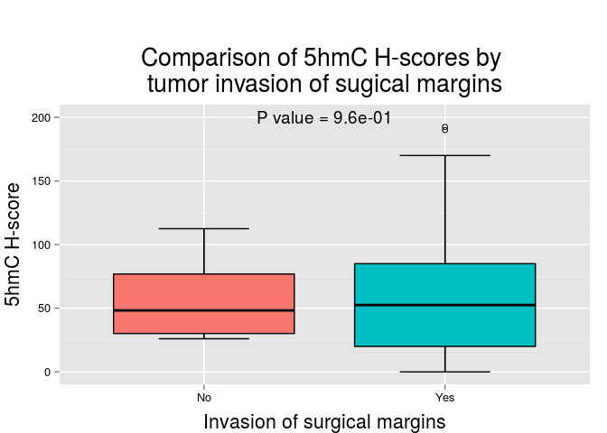 

|                    |  No   |  Yes  |
|:-------------------|:-----:|:-----:|
|Mean                | 58.8  | 59.9  |
|Standard Deviation  | 39.8  | 49.1  |
|Median              | 48.2  | 52.5  |
|Interquartile Range | 46.8  | 65.0  |
|Minimum             | 26.0  |  0.0  |
|Maximum             | 112.5 | 192.5 |

 

|                    |  No   | Yes  |
|:-------------------|:-----:|:----:|
|Mean                | 61.6  | 44.4 |
|Standard Deviation  | 49.0  | 17.2 |
|Median              | 62.5  | 48.2 |
|Interquartile Range | 66.5  | 18.4 |
|Minimum             |  0.0  | 21.0 |
|Maximum             | 192.5 | 60.0 |

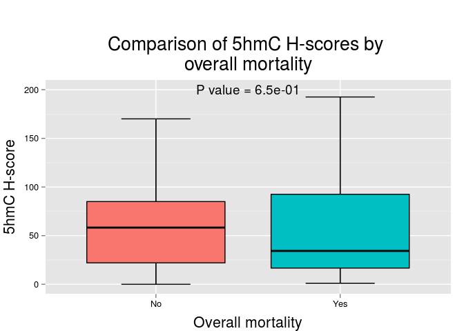 

|                    |  No   |  Yes  |
|:-------------------|:-----:|:-----:|
|Mean                | 58.8  | 67.1  |
|Standard Deviation  | 43.4  | 79.0  |
|Median              | 58.2  | 34.2  |
|Interquartile Range | 63.0  | 75.9  |
|Minimum             |  0.0  |  1.0  |
|Maximum             | 170.0 | 192.5 |

 

|                    |  No   | Yes  |
|:-------------------|:-----:|:----:|
|Mean                | 60.6  | 31.8 |
|Standard Deviation  | 48.5  | 15.2 |
|Median              | 57.0  | 31.8 |
|Interquartile Range | 64.9  | 10.8 |
|Minimum             |  0.0  | 21.0 |
|Maximum             | 192.5 | 42.5 |

***

## Approach # 2

In this approach we will compare 5hmC levels (categorizing 5hmC expression in low/high levels using the `median` as the cutoff point) against clinicopathologic features and outcome. Comparisons will be made using the Fisher's exact test.

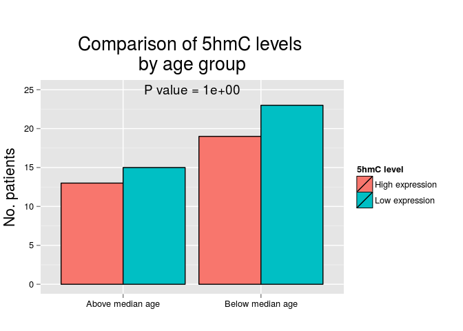 

|                 | High expression |  %   | Low expression |  %   |
|:----------------|:---------------:|:----:|:--------------:|:----:|
|Above median age |       13        | 40.6 |       15       | 39.5 |
|Below median age |       19        | 59.4 |       23       | 60.5 |

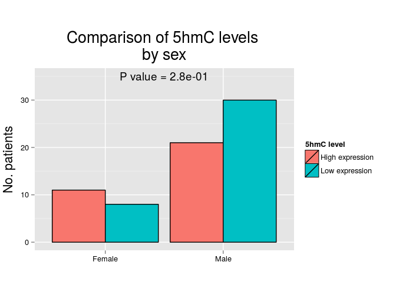 

|       | High expression |  %   | Low expression |  %   |
|:------|:---------------:|:----:|:--------------:|:----:|
|Female |       11        | 34.4 |       8        | 21.1 |
|Male   |       21        | 65.6 |       30       | 78.9 |

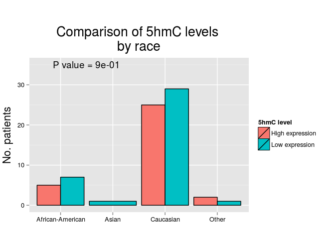 

|                 | High expression |  %   | Low expression |  %   |
|:----------------|:---------------:|:----:|:--------------:|:----:|
|African-American |        5        | 15.6 |       7        | 18.4 |
|Asian            |        0        | 0.0  |       1        | 2.6  |
|Caucasian        |       25        | 78.1 |       29       | 76.3 |
|Other            |        2        | 6.2  |       1        | 2.6  |

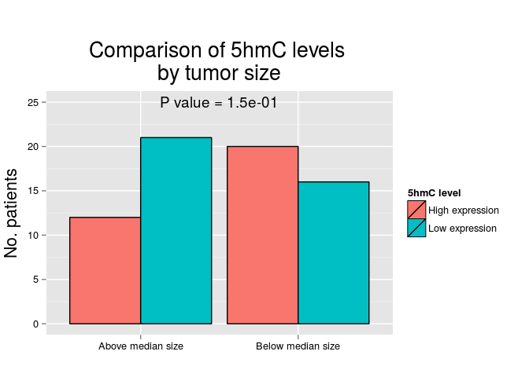 

|                  | High expression |  %   | Low expression |  %   |
|:-----------------|:---------------:|:----:|:--------------:|:----:|
|Above median size |       12        | 37.5 |       21       | 56.8 |
|Below median size |       20        | 62.5 |       16       | 43.2 |

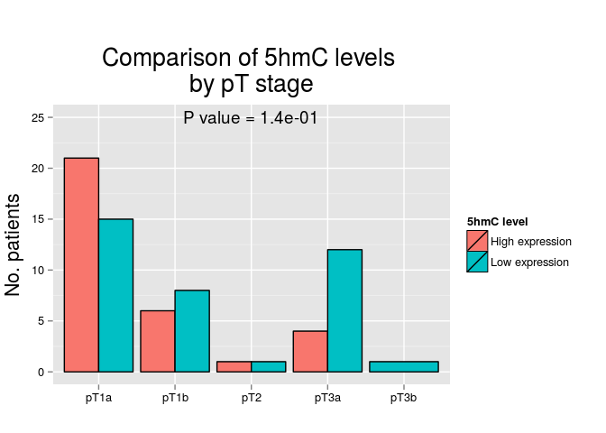 

|     | High expression |  %   | Low expression |  %   |
|:----|:---------------:|:----:|:--------------:|:----:|
|pT1a |       21        | 65.6 |       15       | 40.5 |
|pT1b |        6        | 18.8 |       8        | 21.6 |
|pT2  |        1        | 3.1  |       1        | 2.7  |
|pT3a |        4        | 12.5 |       12       | 32.4 |
|pT3b |        0        | 0.0  |       1        | 2.7  |

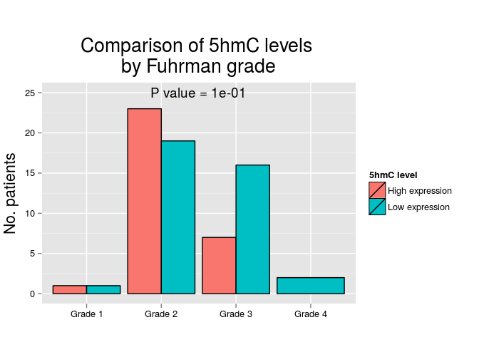 

|        | High expression |  %   | Low expression |  %   |
|:-------|:---------------:|:----:|:--------------:|:----:|
|Grade 1 |        1        | 3.2  |       1        | 2.6  |
|Grade 2 |       23        | 74.2 |       19       | 50.0 |
|Grade 3 |        7        | 22.6 |       16       | 42.1 |
|Grade 4 |        0        | 0.0  |       2        | 5.3  |

 

|    | High expression |  %   | Low expression |  %   |
|:---|:---------------:|:----:|:--------------:|:----:|
|No  |       28        | 87.5 |       32       | 86.5 |
|Yes |        4        | 12.5 |       5        | 13.5 |

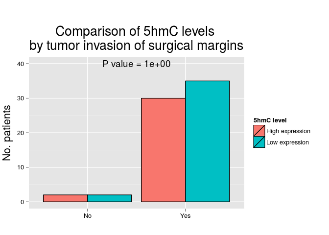 

|    | High expression |  %   | Low expression |  %   |
|:---|:---------------:|:----:|:--------------:|:----:|
|No  |        2        | 6.2  |       2        | 5.4  |
|Yes |       30        | 93.8 |       35       | 94.6 |

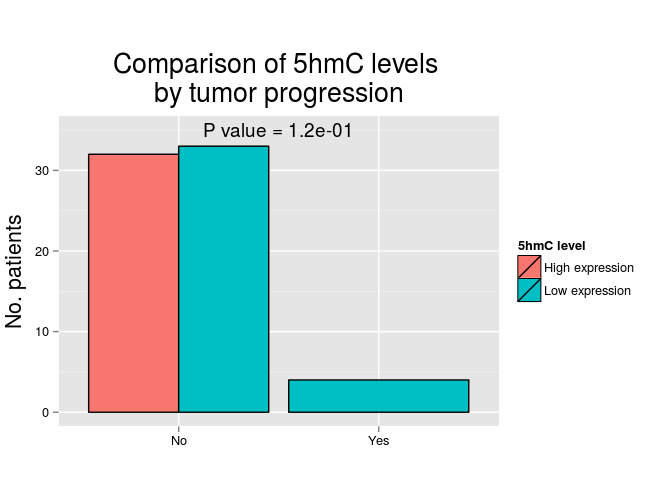 

|    | High expression |  %  | Low expression |  %   |
|:---|:---------------:|:---:|:--------------:|:----:|
|No  |       32        | 100 |       33       | 89.2 |
|Yes |        0        |  0  |       4        | 10.8 |

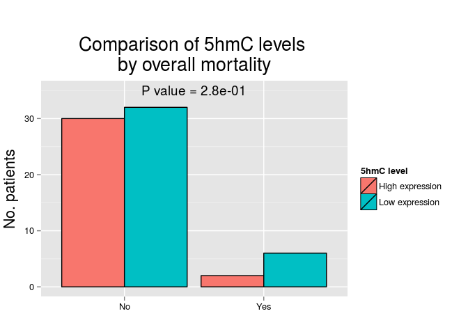 

|    | High expression |  %   | Low expression |  %   |
|:---|:---------------:|:----:|:--------------:|:----:|
|No  |       30        | 93.8 |       32       | 84.2 |
|Yes |        2        | 6.2  |       6        | 15.8 |

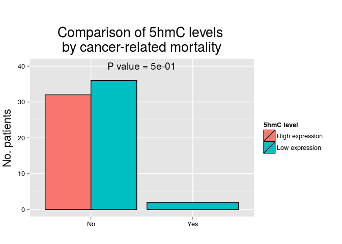 

|    | High expression |  %  | Low expression |  %   |
|:---|:---------------:|:---:|:--------------:|:----:|
|No  |       32        | 100 |       36       | 94.7 |
|Yes |        0        |  0  |       2        | 5.3  |

***

## Approach # 3

In this approach we will compare 5hmC levels (categorizing 5hmC expression in low/high levels using the `upper tertile` as the cutoff point) against clinicopathologic features and outcome. Comparisons will be made using the Fisher's exact test.

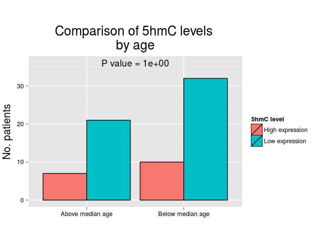 

|                 | High expression |  %   | Low expression |  %   |
|:----------------|:---------------:|:----:|:--------------:|:----:|
|Above median age |        7        | 41.2 |       21       | 39.6 |
|Below median age |       10        | 58.8 |       32       | 60.4 |

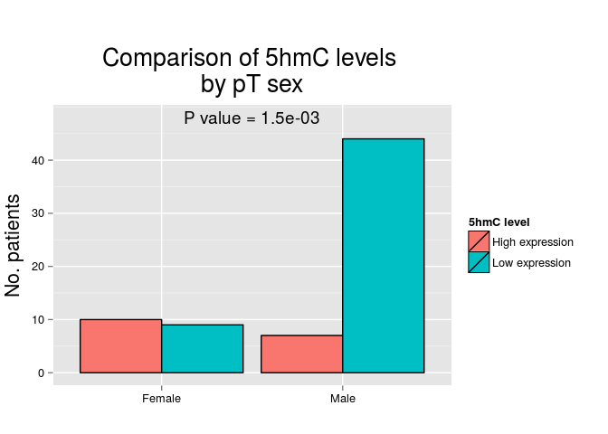 

|       | High expression |  %   | Low expression | %  |
|:------|:---------------:|:----:|:--------------:|:--:|
|Female |       10        | 58.8 |       9        | 17 |
|Male   |        7        | 41.2 |       44       | 83 |

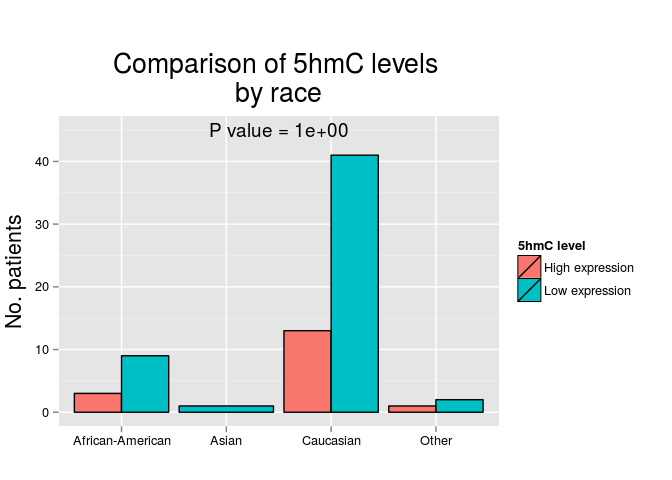 

|                 | High expression |  %   | Low expression |  %   |
|:----------------|:---------------:|:----:|:--------------:|:----:|
|African-American |        3        | 17.6 |       9        | 17.0 |
|Asian            |        0        | 0.0  |       1        | 1.9  |
|Caucasian        |       13        | 76.5 |       41       | 77.4 |
|Other            |        1        | 5.9  |       2        | 3.8  |

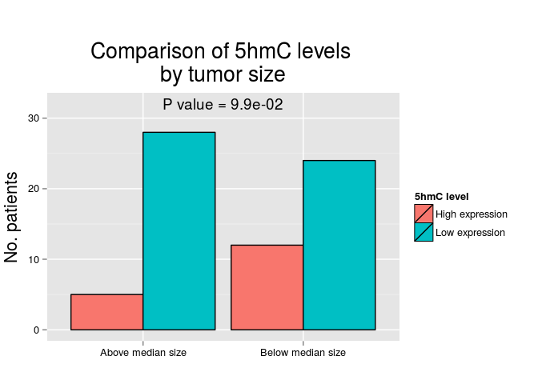 

|                  | High expression |  %   | Low expression |  %   |
|:-----------------|:---------------:|:----:|:--------------:|:----:|
|Above median size |        5        | 29.4 |       28       | 53.8 |
|Below median size |       12        | 70.6 |       24       | 46.2 |

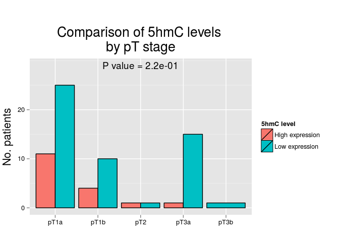 

|     | High expression |  %   | Low expression |  %   |
|:----|:---------------:|:----:|:--------------:|:----:|
|pT1a |       11        | 64.7 |       25       | 48.1 |
|pT1b |        4        | 23.5 |       10       | 19.2 |
|pT2  |        1        | 5.9  |       1        | 1.9  |
|pT3a |        1        | 5.9  |       15       | 28.8 |
|pT3b |        0        | 0.0  |       1        | 1.9  |

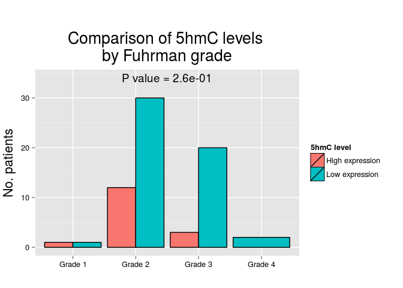 

|        | High expression |  %   | Low expression |  %   |
|:-------|:---------------:|:----:|:--------------:|:----:|
|Grade 1 |        1        | 6.2  |       1        | 1.9  |
|Grade 2 |       12        | 75.0 |       30       | 56.6 |
|Grade 3 |        3        | 18.8 |       20       | 37.7 |
|Grade 4 |        0        | 0.0  |       2        | 3.8  |

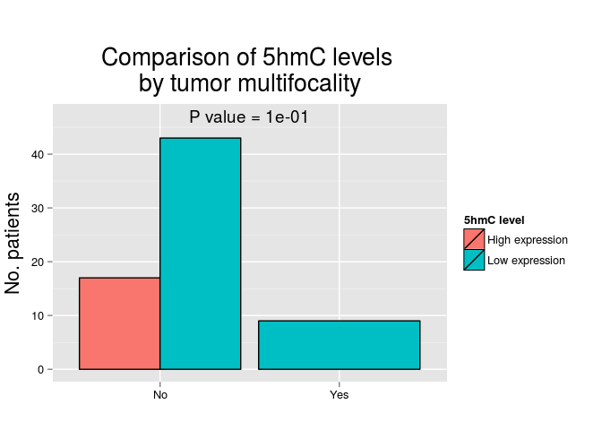 

|    | High expression |  %  | Low expression |  %   |
|:---|:---------------:|:---:|:--------------:|:----:|
|No  |       17        | 100 |       43       | 82.7 |
|Yes |        0        |  0  |       9        | 17.3 |

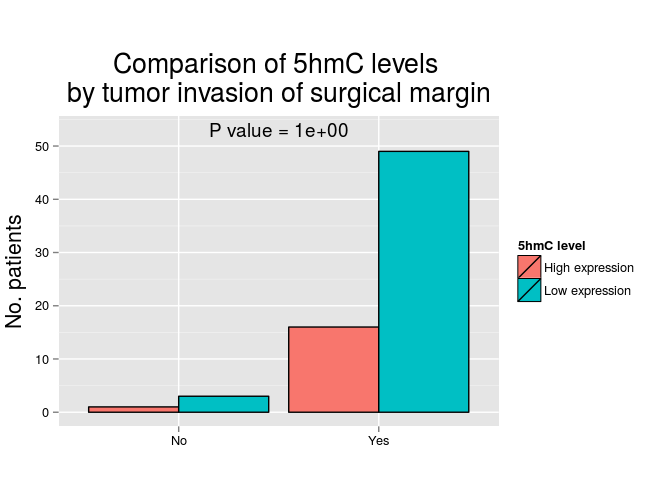 

|    | High expression |  %   | Low expression |  %   |
|:---|:---------------:|:----:|:--------------:|:----:|
|No  |        1        | 5.9  |       3        | 5.8  |
|Yes |       16        | 94.1 |       49       | 94.2 |

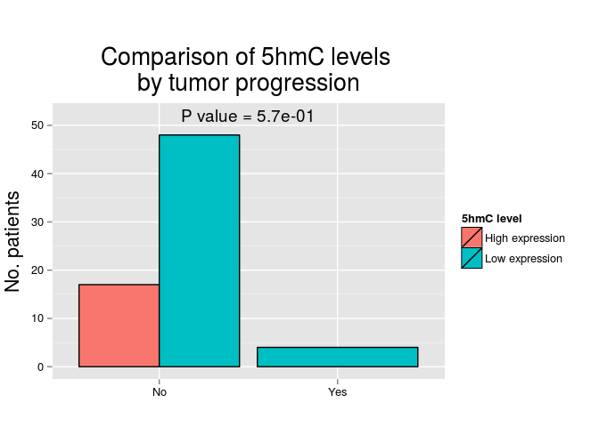 

|    | High expression |  %  | Low expression |  %   |
|:---|:---------------:|:---:|:--------------:|:----:|
|No  |       17        | 100 |       48       | 92.3 |
|Yes |        0        |  0  |       4        | 7.7  |

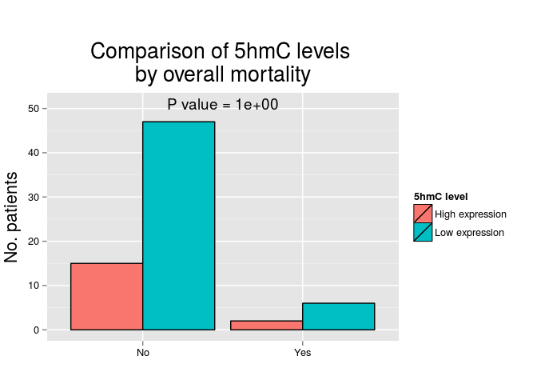 

|    | High expression |  %   | Low expression |  %   |
|:---|:---------------:|:----:|:--------------:|:----:|
|No  |       15        | 88.2 |       47       | 88.7 |
|Yes |        2        | 11.8 |       6        | 11.3 |

 

|    | High expression |  %  | Low expression |  %   |
|:---|:---------------:|:---:|:--------------:|:----:|
|No  |       17        | 100 |       51       | 96.2 |
|Yes |        0        |  0  |       2        | 3.8  |

