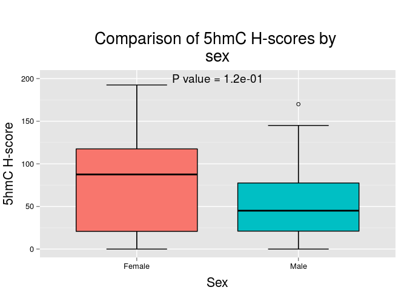
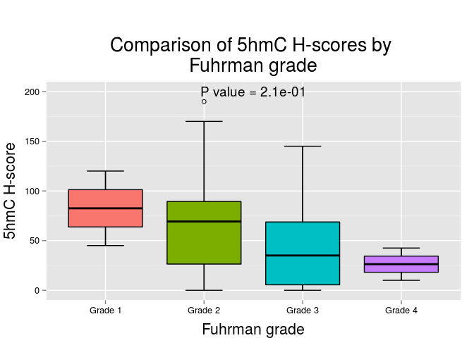

# Expression and outcome in primary tumors

For this section we will use 3 different approaches for evaluating the association of 5hmC and outcome: 1) using 5hmC H-scores; 2) categorizing 5hmC median expression in low/high levels using the median of the distribution as the cutoff point; 3) categorizing 5hmC median expression in low/high levels using the upper tertile of the distribution as the cutoff point.

Outcomes will include tumor progression, overall mortality, and cancer-related mortality. This section includes only the analysis of primary tumors. Metastatic tumors are analyzed separately.

## Approach #1
In this approach we will compare 5hmC `H-scores` against clinicopathologic features and outcome. Comparisons will be made using the Mann-Whitney U test or the Kruskal-Wallis test. Age and tumor size will be categorized in 2 levels using the median age as the cutoff point.

 

|                    | Above median age | Below median age |
|:-------------------|:----------------:|:----------------:|
|Mean                |       62.7       |       57.8       |
|Standard Deviation  |       56.6       |       42.0       |
|Median              |       48.8       |       57.0       |
|Interquartile Range |       68.0       |       63.0       |
|Minimum             |       0.0        |       0.0        |
|Maximum             |      192.5       |      157.5       |

 

|                    | Female | Male  |
|:-------------------|:------:|:-----:|
|Mean                |  78.8  | 52.7  |
|Standard Deviation  |  62.1  | 40.1  |
|Median              |  87.5  | 45.0  |
|Interquartile Range |  96.8  | 56.5  |
|Minimum             |  0.0   |  0.0  |
|Maximum             | 192.5  | 170.0 |

 

|                    | African-American | Asian | Caucasian | Other |
|:-------------------|:----------------:|:-----:|:---------:|:-----:|
|Mean                |       48.2       |   1   |   62.6    | 75.0  |
|Standard Deviation  |       40.0       |  NA   |   50.1    | 36.1  |
|Median              |       42.0       |   1   |   57.0    | 65.0  |
|Interquartile Range |       76.2       |   0   |   59.8    | 35.0  |
|Minimum             |       0.0        |   1   |    0.0    | 45.0  |
|Maximum             |      102.5       |   1   |   192.5   | 115.0 |

 

|                    | Above median size | Below median size |
|:-------------------|:-----------------:|:-----------------:|
|Mean                |       53.9        |       65.3        |
|Standard Deviation  |       52.9        |       43.9        |
|Median              |       35.0        |       70.0        |
|Interquartile Range |       60.0        |       71.6        |
|Minimum             |        0.0        |        0.0        |
|Maximum             |       192.5       |       170.0       |

 

|                    | pT1a  | pT1b  |  pT2  | pT3a  | pT3b |
|:-------------------|:-----:|:-----:|:-----:|:-----:|:----:|
|Mean                | 65.1  | 70.7  | 93.8  | 38.1  |  1   |
|Standard Deviation  | 42.5  | 64.4  | 72.5  | 37.2  |  NA  |
|Median              | 73.8  | 40.0  | 93.8  | 29.5  |  1   |
|Interquartile Range | 67.2  | 57.5  | 51.2  | 58.4  |  0   |
|Minimum             |  0.0  |  0.0  | 42.5  |  0.0  |  1   |
|Maximum             | 170.0 | 192.5 | 145.0 | 130.0 |  1   |

 

|                    | Grade 1 | Grade 2 | Grade 3 | Grade 4 |
|:-------------------|:-------:|:-------:|:-------:|:-------:|
|Mean                |  82.5   |  64.8   |  45.8   |  26.2   |
|Standard Deviation  |  53.0   |  47.0   |  42.1   |  23.0   |
|Median              |  82.5   |  69.2   |  35.0   |  26.2   |
|Interquartile Range |  37.5   |  63.0   |  63.2   |  16.2   |
|Minimum             |  45.0   |   0.0   |   0.0   |  10.0   |
|Maximum             |  120.0  |  190.0  |  145.0  |  42.5   |

 

|                    |  No   | Yes  |
|:-------------------|:-----:|:----:|
|Mean                | 61.5  | 50.3 |
|Standard Deviation  | 50.5  | 30.8 |
|Median              | 51.9  | 62.5 |
|Interquartile Range | 69.9  | 42.5 |
|Minimum             |  0.0  | 1.0  |
|Maximum             | 192.5 | 85.0 |

 

|                    |  No   |  Yes  |
|:-------------------|:-----:|:-----:|
|Mean                | 58.8  | 59.9  |
|Standard Deviation  | 39.8  | 49.1  |
|Median              | 48.2  | 52.5  |
|Interquartile Range | 46.8  | 65.0  |
|Minimum             | 26.0  |  0.0  |
|Maximum             | 112.5 | 192.5 |

 

|                    |  No   | Yes  |
|:-------------------|:-----:|:----:|
|Mean                | 61.6  | 44.4 |
|Standard Deviation  | 49.0  | 17.2 |
|Median              | 62.5  | 48.2 |
|Interquartile Range | 66.5  | 18.4 |
|Minimum             |  0.0  | 21.0 |
|Maximum             | 192.5 | 60.0 |

 

|                    |  No   |  Yes  |
|:-------------------|:-----:|:-----:|
|Mean                | 58.8  | 67.1  |
|Standard Deviation  | 43.4  | 79.0  |
|Median              | 58.2  | 34.2  |
|Interquartile Range | 63.0  | 75.9  |
|Minimum             |  0.0  |  1.0  |
|Maximum             | 170.0 | 192.5 |

 

|                    |  No   | Yes  |
|:-------------------|:-----:|:----:|
|Mean                | 60.6  | 31.8 |
|Standard Deviation  | 48.5  | 15.2 |
|Median              | 57.0  | 31.8 |
|Interquartile Range | 64.9  | 10.8 |
|Minimum             |  0.0  | 21.0 |
|Maximum             | 192.5 | 42.5 |

