# Expression and outcome in metastatic tumors

For this section we will use 3 different approaches for evaluating the association of 5hmC and outcome: 1) using 5hmC H-scores; 2) categorizing 5hmC median expression in low/high levels using the median of the distribution as the cutoff point; 3) categorizing 5hmC median expression in low/high levels using the upper tertile of the distribution as the cutoff point.

Outcomes will include overall mortality and cancer-related mortality. This section includes only the analysis of metastatic tumors. Primary tumors are analyzed separately.

## Approach #1
In this approach we will compare 5hmC `H-scores` against clinicopathologic features and outcome. Comparisons will be made using the Mann-Whitney U test or the Kruskal-Wallis test. Age and tumor size will be categorized in 2 levels using the median age as the cutoff point.

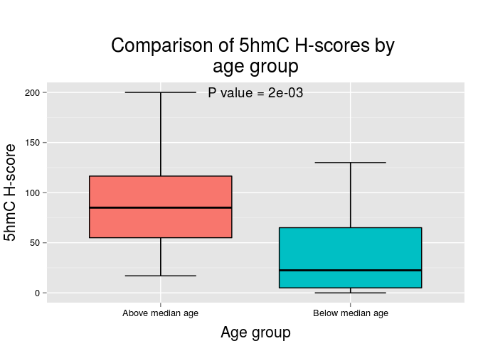 

|                    | Above median age | Below median age |
|:-------------------|:----------------:|:----------------:|
|Mean                |       93.4       |       38.2       |
|Standard Deviation  |       54.3       |       41.7       |
|Median              |       85.0       |       22.5       |
|Interquartile Range |       61.5       |       60.0       |
|Minimum             |       17.0       |       0.0        |
|Maximum             |      200.0       |      130.0       |

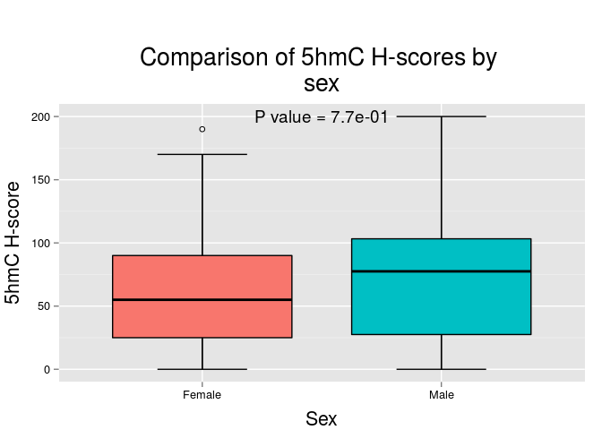 

|                    | Female | Male  |
|:-------------------|:------:|:-----:|
|Mean                |  71.4  | 76.0  |
|Standard Deviation  |  58.4  | 56.5  |
|Median              |  55.0  | 77.5  |
|Interquartile Range |  65.0  | 75.8  |
|Minimum             |  0.0   |  0.0  |
|Maximum             | 190.0  | 200.0 |

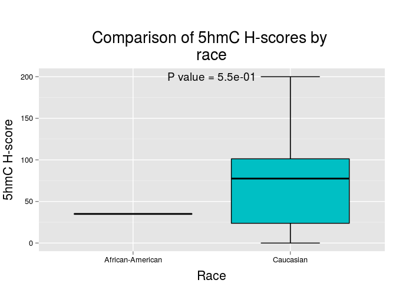 

|                    | African-American | Caucasian |
|:-------------------|:----------------:|:---------:|
|Mean                |        35        |   75.5    |
|Standard Deviation  |        NA        |   56.8    |
|Median              |        35        |   77.5    |
|Interquartile Range |        0         |   77.5    |
|Minimum             |        35        |    0.0    |
|Maximum             |        35        |   200.0   |

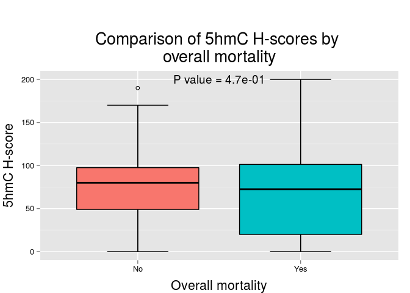 

|                    |  No   |  Yes  |
|:-------------------|:-----:|:-----:|
|Mean                | 80.9  | 70.9  |
|Standard Deviation  | 52.5  | 59.3  |
|Median              | 80.0  | 72.5  |
|Interquartile Range | 48.5  | 81.2  |
|Minimum             |  0.0  |  0.0  |
|Maximum             | 190.0 | 200.0 |

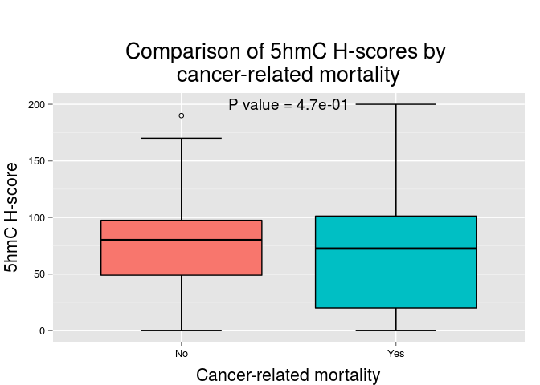 

|                    |  No   |  Yes  |
|:-------------------|:-----:|:-----:|
|Mean                | 80.9  | 70.9  |
|Standard Deviation  | 52.5  | 59.3  |
|Median              | 80.0  | 72.5  |
|Interquartile Range | 48.5  | 81.2  |
|Minimum             |  0.0  |  0.0  |
|Maximum             | 190.0 | 200.0 |

***

## Approach # 2

In this approach we will compare 5hmC levels (categorizing 5hmC expression in low/high levels using the `median` as the cutoff point) against clinicopathologic features and outcome. Comparisons will be made using the Fisher's exact test.

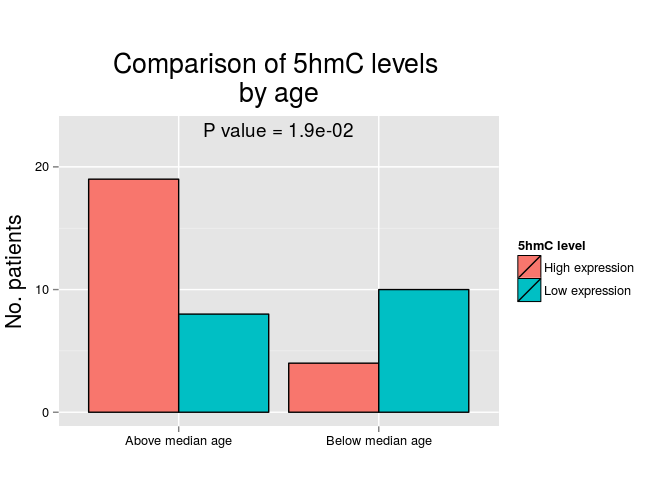 

|                 | High expression |  %   | Low expression |  %   |
|:----------------|:---------------:|:----:|:--------------:|:----:|
|Above median age |       19        | 82.6 |       8        | 44.4 |
|Below median age |        4        | 17.4 |       10       | 55.6 |

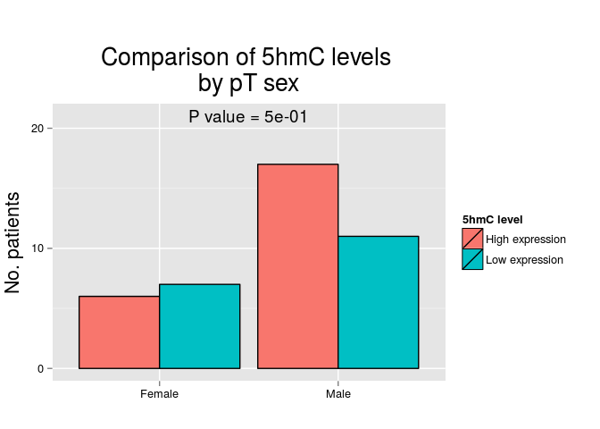 

|       | High expression |  %   | Low expression |  %   |
|:------|:---------------:|:----:|:--------------:|:----:|
|Female |        6        | 26.1 |       7        | 38.9 |
|Male   |       17        | 73.9 |       11       | 61.1 |

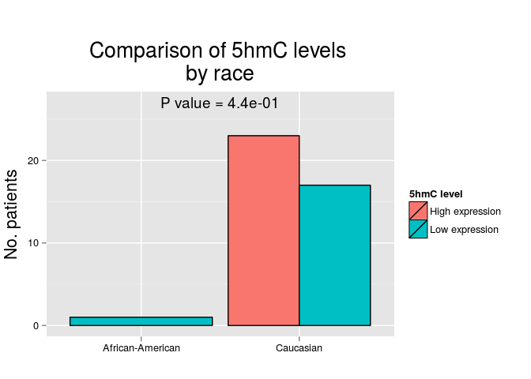 

|                 | High expression |  %  | Low expression |  %   |
|:----------------|:---------------:|:---:|:--------------:|:----:|
|African-American |        0        |  0  |       1        | 5.6  |
|Caucasian        |       23        | 100 |       17       | 94.4 |

 

|    | High expression |  %   | Low expression |  %   |
|:---|:---------------:|:----:|:--------------:|:----:|
|No  |        9        | 39.1 |       6        | 33.3 |
|Yes |       14        | 60.9 |       12       | 66.7 |

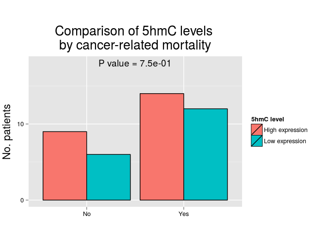 

|    | High expression |  %   | Low expression |  %   |
|:---|:---------------:|:----:|:--------------:|:----:|
|No  |        9        | 39.1 |       6        | 33.3 |
|Yes |       14        | 60.9 |       12       | 66.7 |

***

## Approach # 3

In this approach we will compare 5hmC levels (categorizing 5hmC expression in low/high levels using the `upper tertile` as the cutoff point) against clinicopathologic features and outcome. Comparisons will be made using the Fisher's exact test.

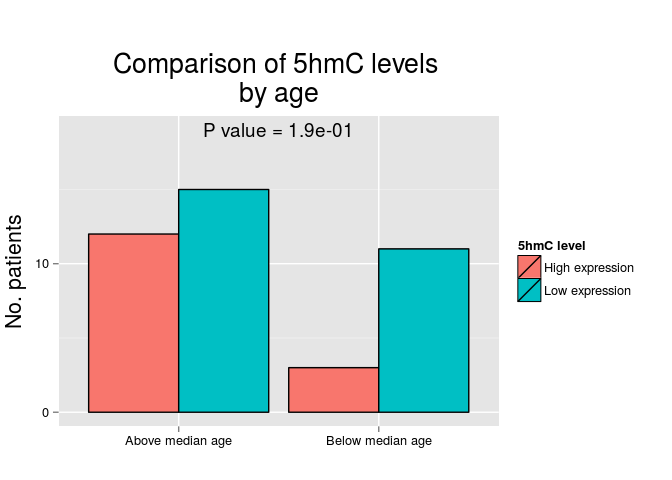 

|                 | High expression | %  | Low expression |  %   |
|:----------------|:---------------:|:--:|:--------------:|:----:|
|Above median age |       12        | 80 |       15       | 57.7 |
|Below median age |        3        | 20 |       11       | 42.3 |

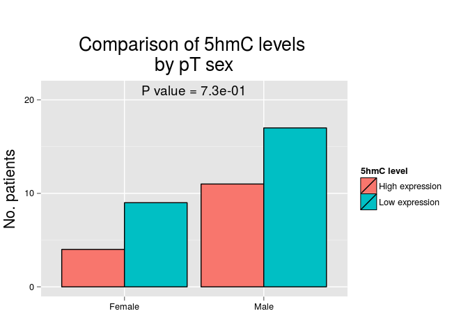 

|       | High expression |  %   | Low expression |  %   |
|:------|:---------------:|:----:|:--------------:|:----:|
|Female |        4        | 26.7 |       9        | 34.6 |
|Male   |       11        | 73.3 |       17       | 65.4 |

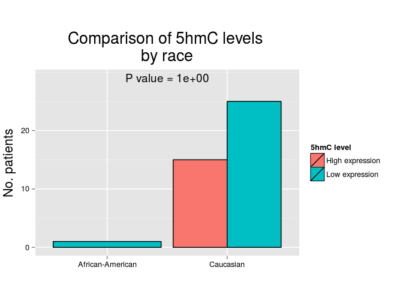 

|                 | High expression |  %  | Low expression |  %   |
|:----------------|:---------------:|:---:|:--------------:|:----:|
|African-American |        0        |  0  |       1        | 3.8  |
|Caucasian        |       15        | 100 |       25       | 96.2 |

 

|    | High expression | %  | Low expression |  %   |
|:---|:---------------:|:--:|:--------------:|:----:|
|No  |        6        | 40 |       9        | 34.6 |
|Yes |        9        | 60 |       17       | 65.4 |

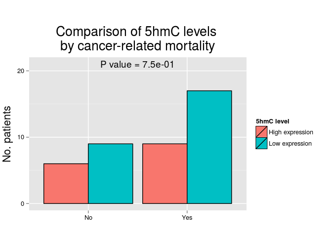 

|    | High expression | %  | Low expression |  %   |
|:---|:---------------:|:--:|:--------------:|:----:|
|No  |        6        | 40 |       9        | 34.6 |
|Yes |        9        | 60 |       17       | 65.4 |

