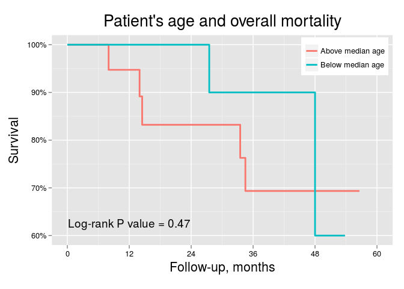
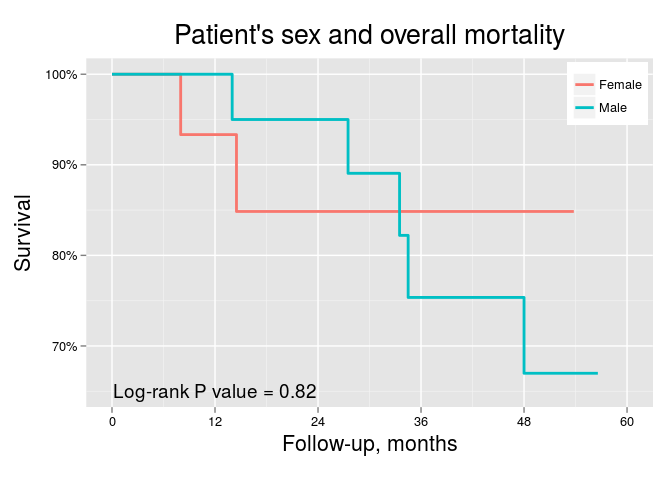
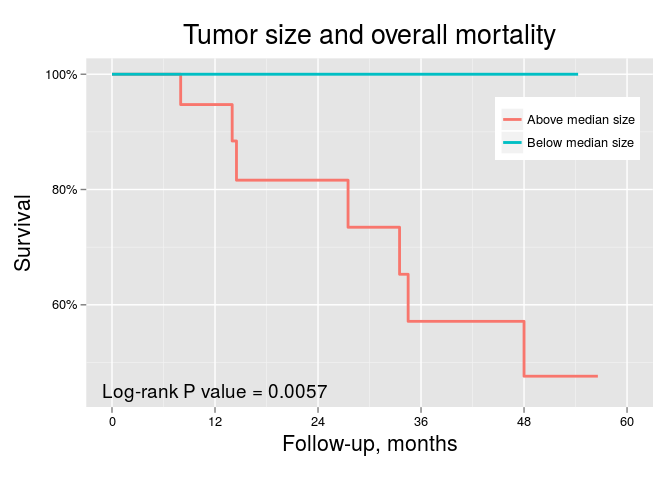
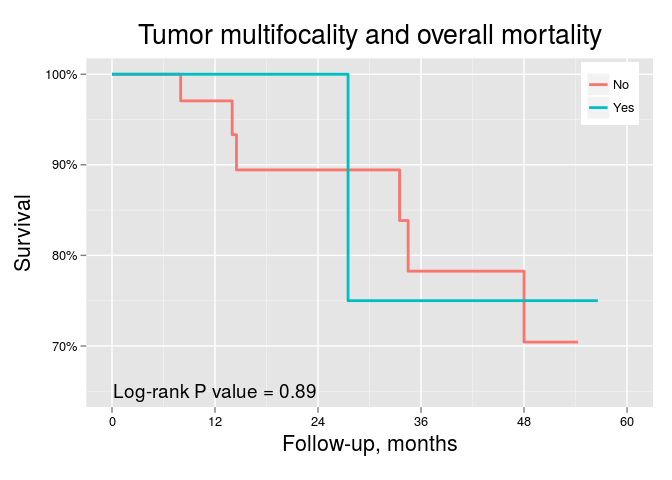
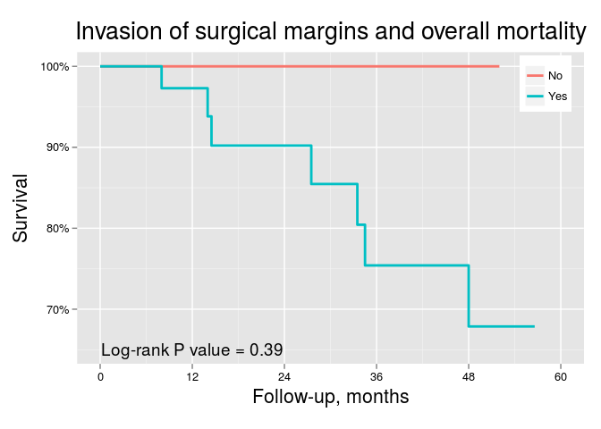
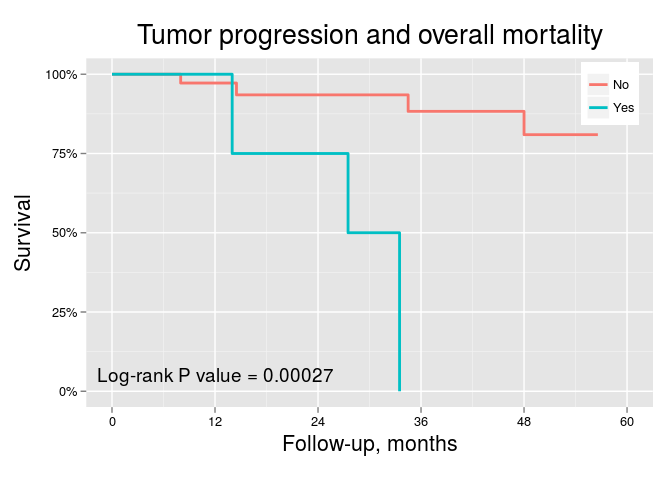
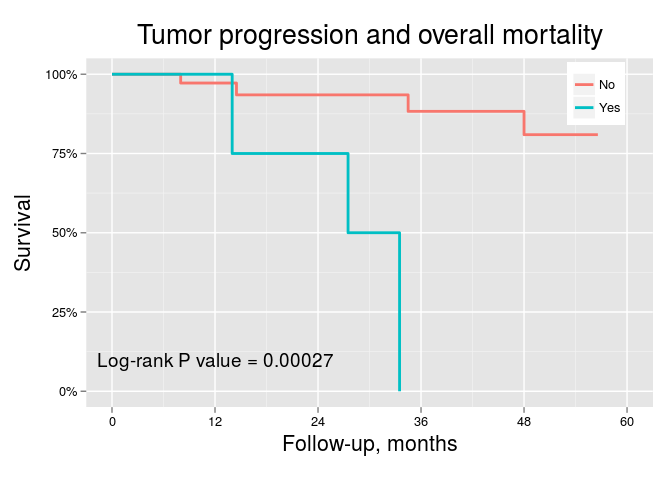

# Expression and survival in primary tumors

In this section we will plot survival curves for overall mortality and cancer-related mortality according to clinicopathologic features and 5hmC expression, categorizing 5hmC expression in low/high levels using as cutoff points: 1) the median; 2) the upper tertile. Follow-up length will be defined as months from nephrectomy.

For age and tumor size we will use the median to define categorical groups. Fuhrman grades and pT stages will also be colapsed in 2-level categorical groups.

This section includes only the analysis of primary tumors. Metastatic tumors are analyzed separately.

***

## Clinicopathologic features and survival
In this section we will plot `Kaplan-Meier curves` for overall mortality and cancer-related mortality considering clinicopathologic features. We will compare survival curves using the `log-rank test`.

### Overall mortality
         

***

### Cancer-related mortality

## 5hmC levels and survival: Approach #1
In this approch we will plot `Kaplan-Meier curves` for overall mortality and cancer-related mortality using the `median` H-score as the cutoff point for defining low/high 5hmC levels. We will compare survival curves using the `log-rank test`.

***

## 5hmC levels and survival: Approach #2
In this approch we will plot `Kaplan-Meier curves` for overall mortality and cancer-related mortality using the upper tertile `Q3` H-score as the cutoff point for defining low/high 5hmC levels. We will compare survival curves using the `log-rank test`.

***
