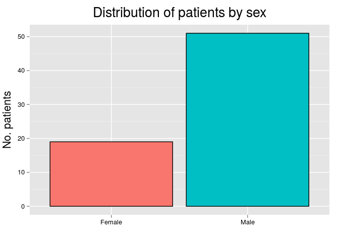

# Descriptive statistics

In this section we will describe the dataset, including patient's clinical features, preoperative and surgical data, pathologic features of the primary and metastatic tumors, and patient's outcome. For this section we will use the full dataset (N = 111), analyzing primary and metastatic tumors separately.

 

|           | No. Cases | %  |
|:----------|:---------:|:--:|
|Metastatic |    41     | 37 |
|Primary    |    70     | 63 |

***

## Primary tumors
 

|Statistics          | Values |
|:-------------------|:------:|
|Mean                |  54.7  |
|Standard Deviation  |  12.5  |
|Median              |   55   |
|Interquartile Range |  17.8  |
|Mininum             |   22   |
|Maximum             |   82   |

 

|       | No. Cases | %  |
|:------|:---------:|:--:|
|Female |    19     | 27 |
|Male   |    51     | 73 |

 

|                 | No. Cases |  %   |
|:----------------|:---------:|:----:|
|Caucasian        |    54     | 77.1 |
|African-American |    12     | 17.1 |
|Other            |     3     | 4.3  |
|Asian            |     1     | 1.4  |

 

|                    | No. Cases | %  |
|:-------------------|:---------:|:--:|
|Partial Nephrectomy |    39     | 56 |
|Radical Nephrectomy |    31     | 44 |

 

|Statistics          | Values |
|:-------------------|:------:|
|Mean                |  4.3   |
|Standard Deviation  |  2.9   |
|Median              |  3.5   |
|Interquartile Range |  2.8   |
|Mininum             |  1.3   |
|Maximum             |   17   |

 

|     | No. Cases |  %   |
|:----|:---------:|:----:|
|pT1a |    36     | 52.2 |
|pT1b |    14     | 20.3 |
|pT2  |     2     | 2.9  |
|pT3a |    16     | 23.2 |
|pT3b |     1     | 1.4  |

 

|        | No. Cases |  %   |
|:-------|:---------:|:----:|
|Grade 1 |     2     | 2.9  |
|Grade 2 |    42     | 60.9 |
|Grade 3 |    23     | 33.3 |
|Grade 4 |     2     | 2.9  |

 

|    | No. Cases | %  |
|:---|:---------:|:--:|
|No  |    60     | 87 |
|Yes |     9     | 13 |

 

|    | No. Cases |  %   |
|:---|:---------:|:----:|
|No  |     4     | 5.8  |
|Yes |    65     | 94.2 |

 

|         | No. Cases |  %   |
|:--------|:---------:|:----:|
|No       |    57     | 81.4 |
|Other    |     8     | 11.4 |
|Prostate |     5     | 7.1  |

 

|Statistics          | Values |
|:-------------------|:------:|
|Mean                |  25.8  |
|Standard Deviation  |   18   |
|Median              |  19.2  |
|Interquartile Range |   38   |
|Mininum             |  3.7   |
|Maximum             |  56.6  |

 

|    | No. Cases |  %   |
|:---|:---------:|:----:|
|No  |    65     | 94.2 |
|Yes |     4     | 5.8  |

 

|    | No. Cases | %  |
|:---|:---------:|:--:|
|No  |    62     | 89 |
|Yes |     8     | 11 |

 

|    | No. Cases |  %   |
|:---|:---------:|:----:|
|No  |    68     | 97.1 |
|Yes |     2     | 2.9  |

 

|Statistics          | Values |
|:-------------------|:------:|
|Mean                | 165.3  |
|Standard Deviation  |  44.1  |
|Median              | 173.1  |
|Interquartile Range |  55.6  |
|Mininum             |   0    |
|Maximum             | 236.2  |

 

|Statistics          | Values |
|:-------------------|:------:|
|Mean                |  168   |
|Standard Deviation  |  41.4  |
|Median              |  175   |
|Interquartile Range |  48.8  |
|Mininum             |   0    |
|Maximum             | 237.5  |

 

|Statistics          | Values |
|:-------------------|:------:|
|Mean                |  56.9  |
|Standard Deviation  |  40.5  |
|Median              |  57.6  |
|Interquartile Range |  58.4  |
|Mininum             |   0    |
|Maximum             | 171.5  |

 

|Statistics          | Values |
|:-------------------|:------:|
|Mean                |  59.8  |
|Standard Deviation  |   48   |
|Median              |  53.2  |
|Interquartile Range |   64   |
|Mininum             |   0    |
|Maximum             | 192.5  |

***

## Pathologic features of metastatic tumors
 

|Statistics          | Values |
|:-------------------|:------:|
|Mean                |  61.6  |
|Standard Deviation  |  10.7  |
|Median              |   63   |
|Interquartile Range |   12   |
|Mininum             |   37   |
|Maximum             |   80   |

 

|       | No. Cases | %  |
|:------|:---------:|:--:|
|Female |    13     | 32 |
|Male   |    28     | 68 |

 

|                 | No. Cases |  %   |
|:----------------|:---------:|:----:|
|Caucasian        |    40     | 97.6 |
|African-American |     1     | 2.4  |
|Asian            |     0     | 0.0  |
|Other            |     0     | 0.0  |

 

|Statistics          | Values |
|:-------------------|:------:|
|Mean                |  61.8  |
|Standard Deviation  |  54.2  |
|Median              |   46   |
|Interquartile Range |   56   |
|Mininum             |   2    |
|Maximum             |  231   |

 

|    | No. Cases | %  |
|:---|:---------:|:--:|
|No  |    15     | 37 |
|Yes |    26     | 63 |

 

|    | No. Cases | %  |
|:---|:---------:|:--:|
|No  |    15     | 37 |
|Yes |    26     | 63 |

 

|Statistics          | Values |
|:-------------------|:------:|
|Mean                |  73.8  |
|Standard Deviation  |  54.7  |
|Median              |   73   |
|Interquartile Range |   78   |
|Mininum             |   0    |
|Maximum             |  200   |

 

|Statistics          | Values |
|:-------------------|:------:|
|Mean                |  74.5  |
|Standard Deviation  |  56.4  |
|Median              |   75   |
|Interquartile Range |   75   |
|Mininum             |   0    |
|Maximum             |  200   |

