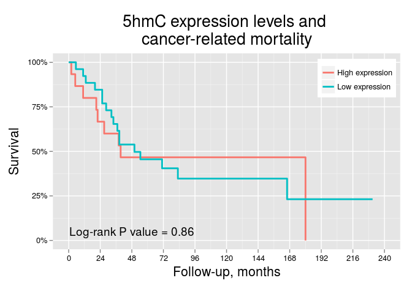

# Expression and survival in metastatic tumors

In this section we will plot survival curves for cancer-related mortality  (since all deaths are cancer-related in this group) according to clinicopathologic features and 5hmC expression, categorizing 5hmC expression in low/high levels using as cutoff points: 1) the median; 2) the upper tertile. Follow-up length will be defined as months from nephrectomy.

For age we will use the median to define categorical groups.

This section includes only the analysis of metastatic tumors. Primary tumors are analyzed separately.

***

## Clinical features and survival
In this section we will plot `Kaplan-Meier curves` for overall mortality and cancer-related mortality considering clinical features. We will compare survival curves using the `log-rank test`.

### Cancer-related mortality
  

## 5hmC levels and survival: Approach #1
In this approch we will plot `Kaplan-Meier curves` for overall mortality and cancer-related mortality using the `median` H-score as the cutoff point for defining low/high 5hmC levels. We will compare survival curves using the `log-rank test`.

 

***

## 5hmC levels and survival: Approach #2
In this approch we will plot `Kaplan-Meier curves` for overall mortality and cancer-related mortality using the upper tertile `Q3` H-score as the cutoff point for defining low/high 5hmC levels. We will compare survival curves using the `log-rank test`.

 

***
