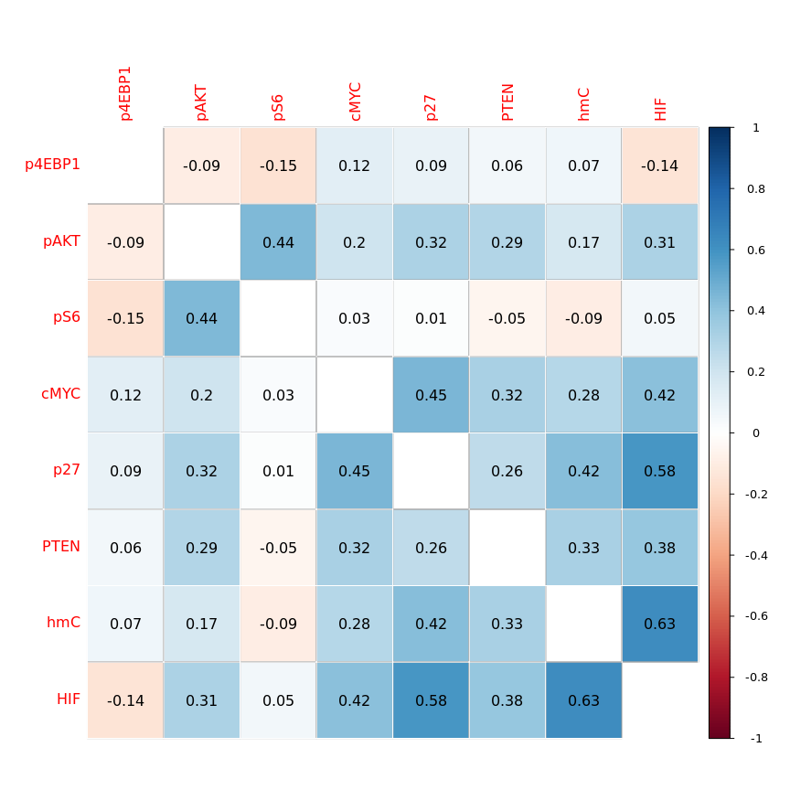
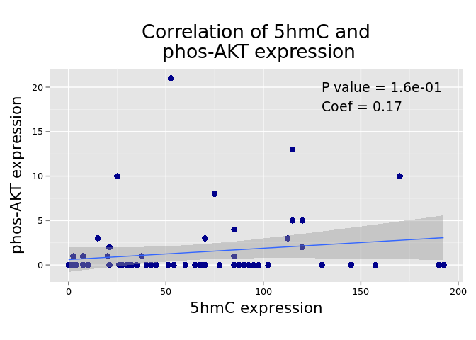
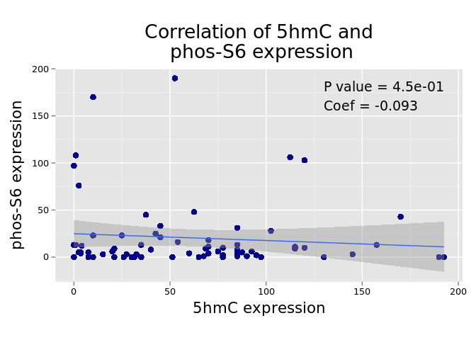
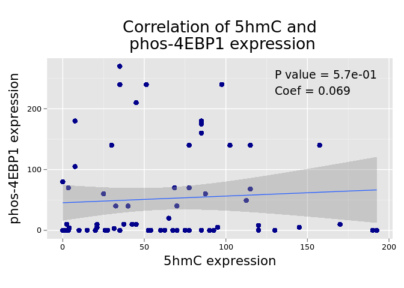
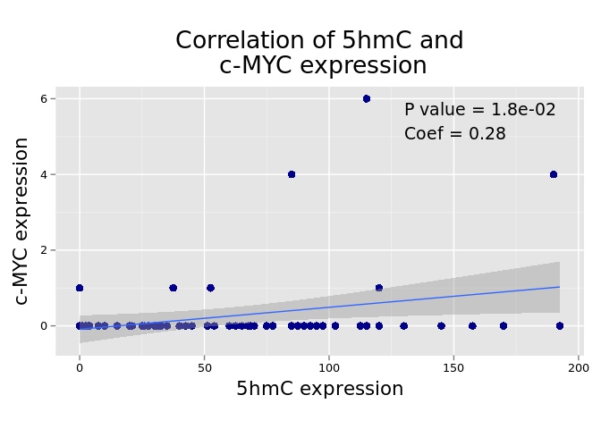
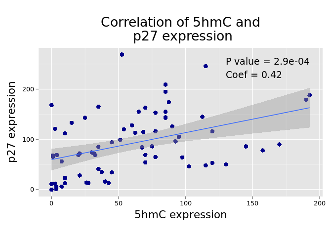
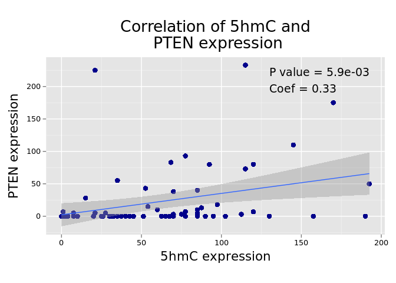
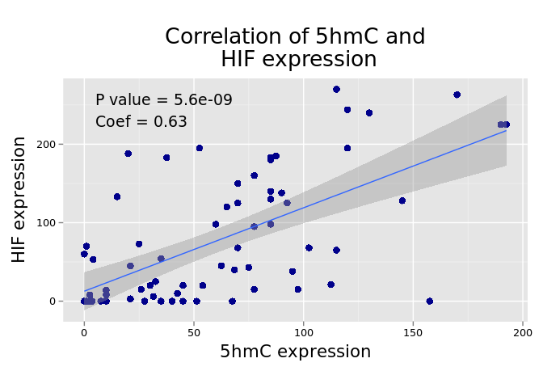

# Correlation with mTOR markers

In this section we will evaluate the correlation between 5hmC median expression and the following markers: PTEN, p-AKT, p-S6, p-4EBP1, p27, c-MYC, and HIF. Data on mTOR markers expression is available only for primary tumors.

## Correlation matrix
First we will plot a correlation matrix of all biomarkers. Color intensity is related to the values of the correlation coefficients; the actual values of the correlation coefficients are also included. Correlation coefficients were reordered using hierarchical clustering.

 

       

